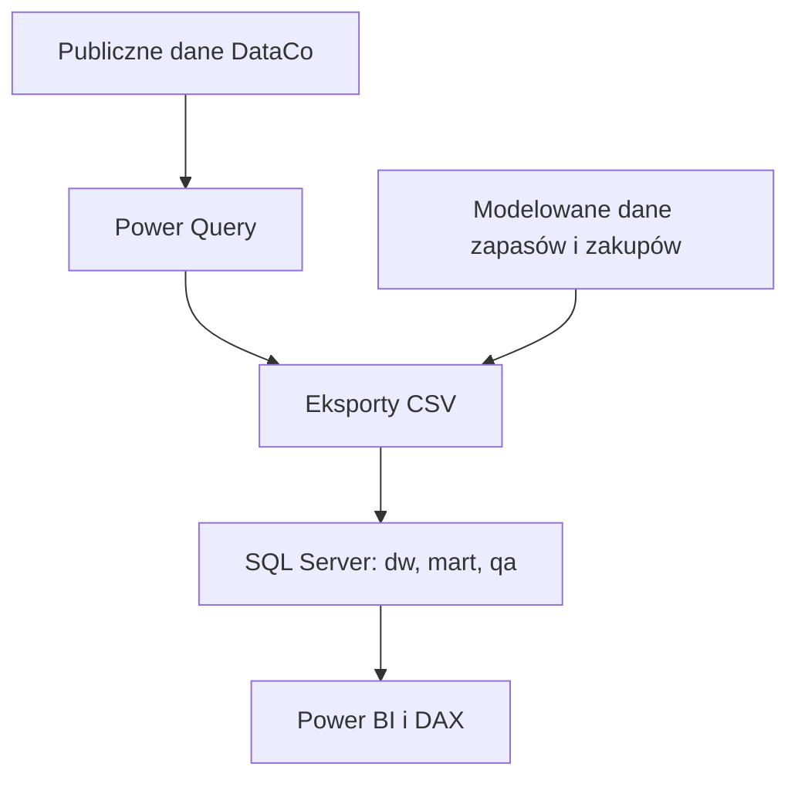

# Analiza łańcucha dostaw i zapasów

Projekt pokazuje pełny proces analityczny: od przygotowania danych w Power Query, przez relacyjny model w SQL Server, aż po zestaw miar DAX i sześciostronicowy raport Power BI. Analiza łączy sprzedaż, dostawy, zapasy, zakupy oraz klasyfikację produktów ABC/XYZ.

Głównym celem było zbudowanie rozwiązania, które nie kończy się na samym dashboardzie. Dane mają określoną ziarnistość, model korzysta ze współdzielonych wymiarów, a wyniki raportu można uzgodnić z warstwą SQL i stroną kontrolną w Power BI.

## Co można sprawdzić w raporcie

- wartość sprzedaży, zysk, marżę i strukturę kategorii,
- terminowość dostaw oraz różnice między sposobami wysyłki,
- dostępność zapasu, ryzyko braku towaru i wartość zapasu końcowego,
- terminowość, kompletność i OTIF dostawców,
- koncentrację sprzedaży oraz stabilność popytu według klas ABC/XYZ.

## Najważniejsze wyniki

W całym dostępnym okresie, po wykluczeniu zamówień anulowanych i oznaczonych jako podejrzane:

- sprzedaż netto wyniosła **31,64 mln USD**, a zysk **3,81 mln USD**, co odpowiada marży **12,03%**;
- terminowo zrealizowano **42,69%** ważnych wysyłek, a 36 048 z 62 897 wysyłek było opóźnionych;
- w modelu zapasów fill rate wyniósł **92,01%**, ekspozycja na brak zapasu **0,51%**, a końcowa wartość zapasu **2,64 mln USD**;
- w modelu zakupowym OTIF dostawców wyniósł **71,85%**, przy fill rate na poziomie **97,97%**;
- siedem produktów klasy A odpowiadało za około **76,9%** sprzedaży ujętej w klasyfikacji.

Wyniki sprzedaży i wysyłek pochodzą z publicznego zbioru DataCo. Dane o stanach magazynowych, zamówieniach zakupu i dostawcach zostały przygotowane jako spójny scenariusz analityczny. Nie należy interpretować ich jako rzeczywistych wyników konkretnej firmy.

## Przepływ danych



Power Query odpowiada za oczyszczenie danych źródłowych, rozdzielenie faktów i wymiarów oraz przygotowanie flag jakościowych. SQL Server przechowuje model, wystawia widoki raportowe i zapewnia warstwę kontroli. Power BI korzysta z modelu wielofaktowego oraz jednej tabeli miar.

## Zakres danych

| Obszar | Ziarnistość | Liczba rekordów |
| --- | --- | ---: |
| Dane źródłowe DataCo | Wiersz zamówienia | 180 519 |
| Sprzedaż | Wiersz zamówienia | 180 519 |
| Wysyłki | Jedno zamówienie i jego wysyłka | 65 752 |
| Dzienne stany zapasów | Dzień, produkt i magazyn | 311 416 |
| Zamówienia zakupu | Jedno zamówienie zakupu | 2 199 |
| Produkty | Jeden produkt | 118 |
| Dostawcy | Jeden dostawca | 24 |

Dane sprzedażowe obejmują okres od 1 stycznia 2015 r. do 31 stycznia 2018 r. Kalendarz i model zapasów sięgają do 7 marca 2018 r. Dokładny opis plików i ich pochodzenia znajduje się w [data/README.md](data/README.md).

## Model analityczny

W Power BI znajdują się cztery tabele faktów:

- `FAKT_Sales`,
- `FAKT_Shipments`,
- `FAKT_Inventory`,
- `FAKT_Purchase_orders`.

Współdzielone wymiary opisują datę, produkt, klienta, geografię, sposób wysyłki, magazyn i dostawcę. Model zawiera 23 relacje. Relacje prowadzą od wymiarów do faktów i filtrują dane w jednym kierunku.

Dla sprzedaży i wysyłek aktywną datą jest data zamówienia. Daty wysyłki i planowanej wysyłki pozostają relacjami nieaktywnymi. W zapasach aktywna jest data migawki, a w zakupach data złożenia zamówienia. Dzięki temu jeden kalendarz może obsługiwać wszystkie obszary bez niejednoznacznych ścieżek filtrowania.

Model zawiera 66 miar DAX zapisanych w tabeli `KPI_Measures`. Kolumny techniczne i klucze są ukryte przed użytkownikiem raportu.

## Raport Power BI

Głównym plikiem jest [powerBI/ChainSupplyAnalysis.pbix](powerBI/ChainSupplyAnalysis.pbix). Raport zawiera pięć stron biznesowych oraz stronę techniczną.

| Strona | Zastosowanie |
| --- | --- |
| `00_QA` | Kontrola liczby rekordów, zakresu dat i głównych agregacji |
| `Executive Overview` | Najważniejsze KPI oraz trend sprzedaży i zysku |
| `Delivery Performance` | Terminowość, opóźnienia i porównanie sposobów wysyłki |
| `Inventory Health` | Dostępność, ryzyko braku towaru i pozycja zapasowa magazynów |
| `Supplier Performance` | OTIF, fill rate, terminowość, kompletność i lead time |
| `Product Classification` | Sprzedaż, zysk i utracona sprzedaż według klas ABC/XYZ |

Strony biznesowe korzystają ze wspólnego układu: tytuł i filtr u góry, sześć kart KPI oraz dwa wykresy analityczne. Szczegóły raportu i sposób odświeżenia opisano w [powerBI/README.md](powerBI/README.md).

## Warstwa SQL

Baza `SupplyChainAnalytics` wykorzystuje trzy schematy:

- `dw` dla wymiarów i faktów,
- `mart` dla klasyfikacji produktów i widoków używanych przez Power BI,
- `qa` dla uzgodnień liczby rekordów, kluczy osieroconych i KPI.

Skrypty należy uruchamiać w kolejności od `00_create_database.sql` do `04_qa_checks.sql`. Szczegółowa kolejność ładowania danych i ważne informacje o kluczach dat znajdują się w [sql/README.md](sql/README.md).

## Jak uruchomić projekt

### Sam raport

1. Otwórz `powerBI/ChainSupplyAnalysis.pbix` w Power BI Desktop.
2. Zapisany model zawiera dane, więc raport można przejrzeć bez natychmiastowego odświeżania.
3. Przed prezentacją sprawdź stronę `00_QA`.

### Odtworzenie całego przepływu

1. Utwórz bazę i schematy za pomocą skryptów `00` i `01`.
2. Na pustej bazie uruchom `02_create_tables.sql`.
3. Załaduj wymiary, a następnie fakty z katalogu `data/processed`.
4. Utwórz widoki raportowe za pomocą `03_create_views.sql`.
5. Uruchom `04_qa_checks.sql` i sprawdź, czy liczby rekordów oraz KPI są zgodne.
6. W ustawieniach źródeł danych Power BI wskaż własną instancję SQL Server i bazę `SupplyChainAnalytics`.
7. Odśwież model i ponownie sprawdź `00_QA`.

Import CSV nie jest zautomatyzowany. Pliki sprzedaży i wysyłek zawierają daty operacyjne, natomiast model SQL przechowuje dodatkowo klucze dat. Podczas ładowania należy wyprowadzić je przez konwersję odpowiednich znaczników czasu do typu `date`. Dokładne mapowanie znajduje się w dokumentacji SQL.

## Struktura repozytorium

```text
Analiza_Lancucha_Dostaw/
|-- data/
|   |-- raw/
|   `-- processed/
|       |-- generated_data/
|       `-- powerquery_exports/
|-- powerBI/
|-- sql/
|-- CHANGELOG.md
`-- README.md
```

## Technologie

- Power Query i Power BI,
- DAX,
- SQL Server i SQL Server Management Studio,
- Python do przygotowania scenariusza zapasów i zakupów,
- Git i GitHub.

## Ograniczenia

- Część zapasowa i zakupowa ma charakter modelowany, dlatego służy do demonstracji metod analitycznych, a nie do oceny rzeczywistej firmy.
- Import plików CSV do SQL Server wymaga ręcznego wskazania mapowania i kluczy dat.
- Projekt nie obejmuje automatycznego odświeżania w Power BI Service ani prognozowania popytu.

## Źródło danych

Fabian Constante, Fernando Silva, António Pereira (2019), *DataCo SMART SUPPLY CHAIN FOR BIG DATA ANALYSIS*, Mendeley Data, Version 5.

DOI: <https://doi.org/10.17632/8gx2fvg2k6.5>

Licencja danych: CC BY 4.0.

## Autor

Oskar Kowalczyk
