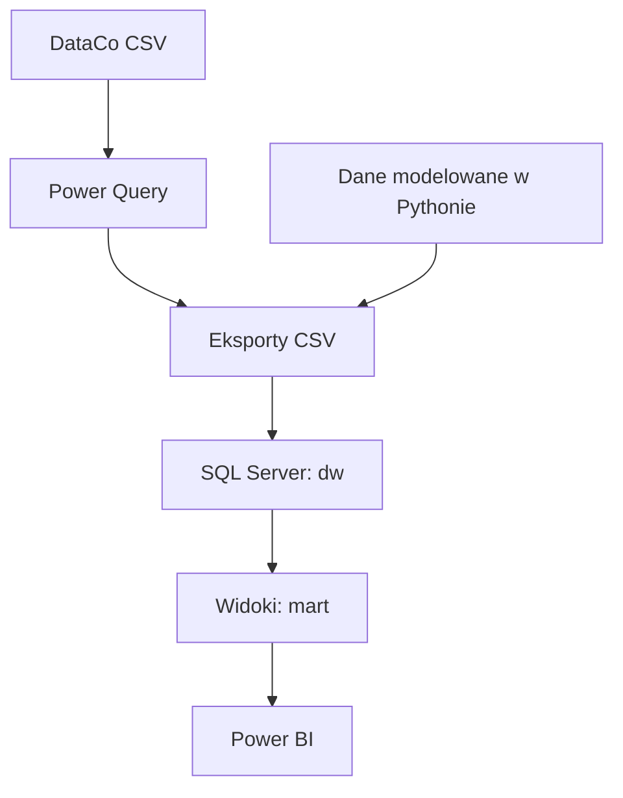

# Analiza łańcucha dostaw i zapasów

Projekt przedstawia pełny przepływ danych od pliku źródłowego przez Power Query i SQL Server do modelu analitycznego oraz raportu Power BI. Celem jest analiza sprzedaży, terminowości dostaw, dostępności zapasów, pracy dostawców i klasyfikacji produktów.

## Status projektu

Stan na 16.07.2026: projekt jest w trakcie realizacji.

| Obszar | Status | Obecny zakres |
| --- | --- | --- |
| Dane źródłowe | Gotowe | Plik DataCo i opis 53 pól |
| Power Query | Gotowe dla obecnego zakresu | Wymiary, fakty sprzedaży i wysyłek, flagi jakościowe oraz eksporty CSV |
| Dane pomocnicze | Gotowe jako pliki CSV | Kalendarz, dostawcy, dzienne stany zapasów, zamówienia zakupu i klasyfikacja ABC/XYZ |
| SQL Server | Częściowo gotowe | Baza `SupplyChainAnalytics`, schematy `dw`, `mart`, `qa`, tabele, klucze i 5 widoków raportowych |
| Power BI | W trakcie | Model danych, strona kontroli `00_QA` i strona `Executive Overview` |
| Dokumentacja | W trakcie | Uzupełnione README, brakuje zrzutów, słownika danych, eksportu miar DAX i końcowych wniosków |

Projekt nie jest jeszcze wersją końcową. Aktualny raport Power BI zawiera 2 strony, z czego jedna służy do kontroli modelu.

## Architektura rozwiązania



Warstwa danych składa się z dwóch części:

1. Dane źródłowe DataCo dotyczą zamówień, klientów, produktów, sprzedaży i wysyłek.
2. Dane dostawców, zakupów i dziennych stanów magazynowych są danymi modelowanymi. Nie są to rzeczywiste dane operacyjne DataCo.

## Zakres danych

| Grupa | Najważniejsze pliki | Liczba rekordów |
| --- | --- | ---: |
| Dane źródłowe | `DataCoSupplyChainDataset.csv` | 180 519 |
| Wiersze zamówień | `FAKT_OrderLines.csv` | 180 519 |
| Wysyłki | `FAKT_Shipments.csv` | 65 752 |
| Dzienne stany zapasów | `fact_inventory_daily.csv` | 311 416 |
| Zamówienia zakupu | `fact_purchase_orders.csv` | 2 199 |
| Produkty | `DIM_Product.csv` | 118 |
| Dostawcy | `dim_supplier.csv` | 24 |

Dane sprzedażowe obejmują okres od 01.01.2015 do 31.01.2018. Kalendarz i symulacja zapasów obejmują okres od 01.01.2015 do 07.03.2018.

Szczegółowy opis plików znajduje się w [data/README.md](data/README.md).

## Model danych

Model Power BI jest modelem wielofaktowym opartym na współdzielonych wymiarach.

Tabele faktów:

- `FAKT_Sales`
- `FAKT_Shipments`
- `FAKT_Inventory`
- `FAKT_Purchase_orders`

Wymiary:

- `DIM_Date`
- `DIM_Product`
- `DIM_Customer`
- `DIM_Geography`
- `DIM_Shipping_mode`
- `DIM_Warehouse`
- `DIM_Supplier`

Miary są przechowywane w osobnej tabeli `KPI_Measures`.

## Warstwa SQL

Baza danych nosi nazwę `SupplyChainAnalytics` i wykorzystuje trzy schematy:

- `dw` przechowuje tabele wymiarów i faktów,
- `mart` przechowuje klasyfikację produktów i widoki pod Power BI,
- `qa` jest przygotowany pod kontrole jakości.

Obecne widoki raportowe:

- `mart.vw_dim_product`
- `mart.vw_fact_sales`
- `mart.vw_fact_shipments`
- `mart.vw_fact_inventory`
- `mart.vw_fact_purchase_orders`

Dokładny opis skryptów i obecnych ograniczeń znajduje się w [sql/README.md](sql/README.md).

## KPI w Power BI

Obecny model obejmuje miary z pięciu obszarów:

- sprzedaż: `Net Sales`, `Profit`, `Profit Margin %`, `Units Sold`,
- dostawy: `On-Time Delivery %`, `Late Shipments`, `Average Shipping Days`,
- zapasy: `Inventory Value EOP`, `Inventory Fill Rate %`, `Stockout Exposure %`, `Median Days of Supply EOP`,
- zakupy i dostawcy: `Supplier OTIF %`, `Supplier Fill Rate %`, `PO On-Time %`, `PO In-Full %`,
- kontrola modelu: liczba rekordów, pierwsza i ostatnia data oraz zgodność agregacji.

## Strony raportu Power BI

### Gotowe

1. `00_QA`
   - kontrola liczby rekordów,
   - kontrola zakresu dat,
   - kontrola miar sprzedaży, dostaw, zapasów, zakupów i klasyfikacji.

2. `Executive Overview`
   - filtr zakresu dat,
   - karty głównych KPI,
   - sprzedaż netto i zysk w czasie,
   - 10 kategorii z najwyższą sprzedażą netto.

### Do wykonania

3. `Delivery Performance`
4. `Inventory Health`
5. `Supplier Performance`
6. `Product Classification`

Pozycje od 2 do 6 tworzą docelowe 5 stron biznesowych. Strona `00_QA` jest stroną techniczną i nie wchodzi do tej liczby.

Więcej informacji znajduje się w [powerBI/README.md](powerBI/README.md).

## Struktura repozytorium

```text
Analiza_Lancucha_Dostaw/
|-- data/
|   |-- raw/
|   `-- processed/
|       |-- generated_data/
|       `-- powerquery_exports/
|-- documentation/
|-- powerBI/
|-- sql/
|-- .gitattributes
|-- .gitignore
`-- README.md
```

## Uruchomienie na obecnym etapie

1. Otwórz repozytorium lokalnie.
2. Sprawdź opis i kolejność danych w [data/README.md](data/README.md).
3. W SQL Server uruchom `sql/00_create_database.sql` i `sql/01_create_schemas.sql`.
4. Przed uruchomieniem `sql/02_create_tables.sql` popraw błąd wskazany w [sql/README.md](sql/README.md).
5. Zaimportuj wymiary przed tabelami faktów. Obecny import nie jest jeszcze zautomatyzowany.
6. Po załadowaniu danych uruchom `sql/03_create_views.sql`.
7. Otwórz `powerBI/ChainSupplyAnalysis.pbix` i ustaw połączenie z własną instancją SQL Server.
8. Odśwież model i sprawdź stronę `00_QA` przed analizą wyników.

## Technologie

- Power Query
- SQL Server
- SQL Server Management Studio
- Power BI
- DAX
- Python, wykorzystany wcześniej do przygotowania danych modelowanych
- Git i GitHub

## Źródło danych

Podstawowe dane zamówień, produktów i wysyłek pochodzą z:

Fabian Constante, Fernando Silva, António Pereira (2019), `DataCo SMART SUPPLY CHAIN FOR BIG DATA ANALYSIS`, Mendeley Data, Version 5.

DOI: <https://doi.org/10.17632/8gx2fvg2k6.5>

Licencja danych wskazana w projekcie: CC BY 4.0.

## Autor

Oskar Kowalczyk
